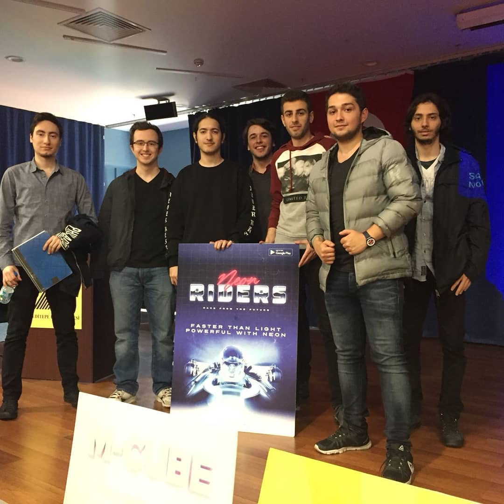

# Neon Riders

This is a interdisciplinary school project for our "Software Engineering" class. In this class we were expected to create any kind of game. So, we have created this game. This game is intended to play on mobile, but we were instructed at a later date that it must be executable in the desktop also. So, it has deployables for desktop also.

## Used Technologies
- Unity3D
- C#
- Maya
- Photoshop

## The Team
- **Project Manager**
  - Berkay KOÇAK
- **Lead Developer**
  - Adnan Çığtekin
- **Developers**
  - Afşin Baran Bayezid
  - Uğur Nezir
  - Mehmet Selimoğlu
- **Documentation**
  - Ahmet Mete Karayaka
- **Modellers**
  - Mehmet Kaan Öztürk
  - Murathan Biliktü

### Trello Link
https://trello.com/b/R6vqvSHd/alpha-20

## Credits  

